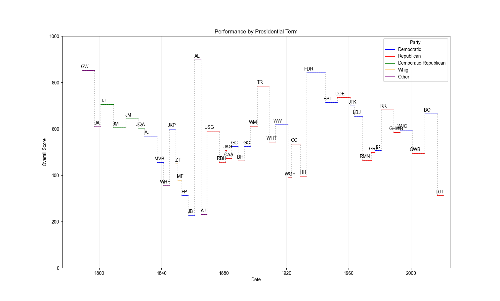
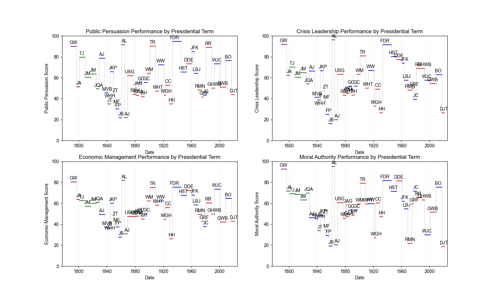
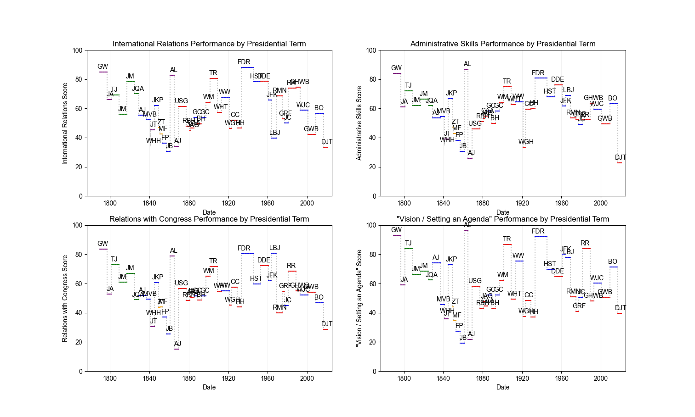
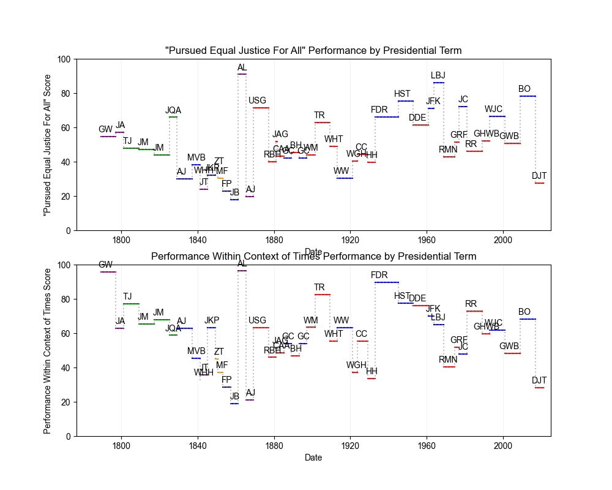

# Presidential Performance Timeline
The Presidential Performance Timeline is a data visualization project logging CSPAN's Presidential Historian's Survey results via a timeline plot. You can see the overall rankings below: 

You can also see the performance by party and term below:

By Public Persuasion, Crisis Leadership, Economic Management, and Moral Authority:

By International Relations, Administrative Skills, and Relations with Congress:

By "Vision / Setting an Agenda", "Pursued Equal Justice For All", and "Performance Within Context of Times":

The `overall.py` file is the code used to create the overall timeline plot. The `subplots.py` file is the code used to create the subplots.

All data for this project was from the CSPAN Presidential Historian's Survey (https://www.c-span.org/presidentsurvey2021/). Feel free to use the code for your own projects!
